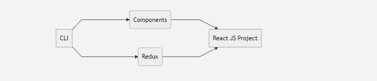

# React Js Command Line (cli)

Hi! guys this package is very useful while developing big project with **react js** and **react redux**.



## Getting Started

```sh
npm i react-filegen -g
```
> **Note  :**  Don't install this in your project, install only gloablly using **-g** while installing package


## Create Component

```sh
npx react-filegen component <Component Name>
```

|args           |Values                         |description                                            |
|---------------|-------------------------------|-------------------------------------------------------|
|--class        |`boolean`                      | true|false                                            |
|--style        |`boolean`                      | true|false                                            |
|--path         |`directory location`           | path if you want to create in diffrent  destination   |

> **Note  :** default value check in your config (reactclitest.json)


## Create Reducer
```sh
npx react-filegen reducer <Reducer Name>
```

|args           |Values                         |description                                            |
|---------------|-------------------------------|-------------------------------------------------------|
|--path         |`directory location`           | path if you want to create in diffrent  destination   |

> **Note  :** default value check in your config (reactclitest.json)